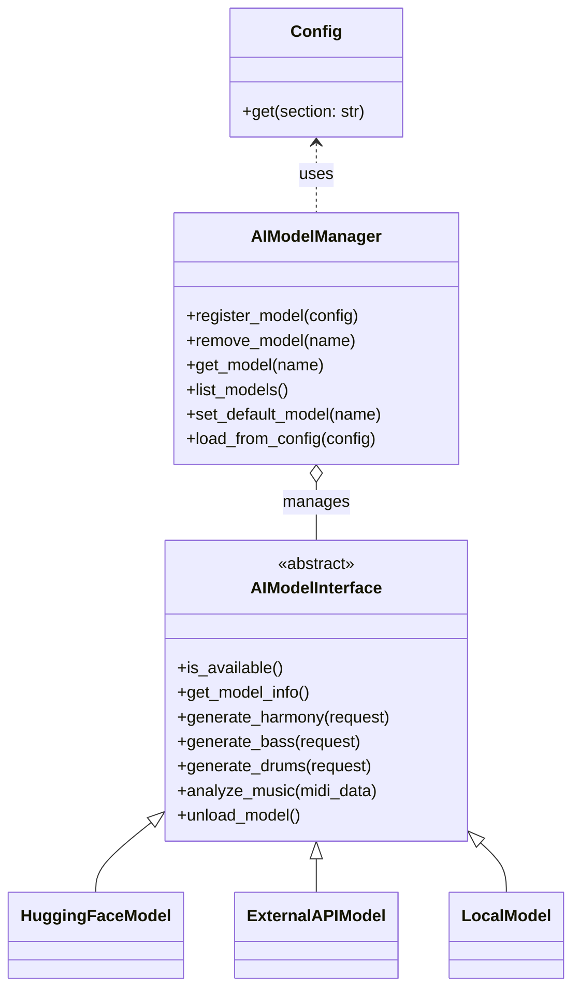

# AI Model Management Design

## Goals & Requirements
- Manage multiple AI models (HuggingFace, external API, local, custom, etc.) in a unified way
- Support model registration, removal, listing, info, and default switching
- Track model state (loaded/unloaded, availability, version, etc.)
- Allow model selection/switching from CLI and API
- Load model info from a config file (YAML/JSON)
- Enable future extensibility (new model types, plugins, versioning, etc.)

## Recommended Architecture

- **Config module**: Unified config loader (see `merlai/config.py`)
- **AIModelManager**: Central manager for model registration, selection, state
- **AIModelInterface**: Abstract base class for all models
- **Concrete model classes**: HuggingFaceModel, ExternalAPIModel, LocalModel, etc.
- **CLI/API integration**: Model selection, listing, info, default switching

## Class Diagram



## Config Example (YAML)

```yaml
ai_models:
  default: "my-hf-model"
  available:
    - name: "my-hf-model"
      type: "huggingface"
      model_path: "path/to/model"
    - name: "my-api-model"
      type: "external_api"
      endpoint: "https://api.example.com"
      api_key: "xxxx"
```

## CLI/API Usage Examples

- List models: `merlai model list`
- Model info: `merlai model info --model my-hf-model`
- Set default: `merlai model set-default my-api-model`
- Generate with model: `merlai generate --model my-hf-model ...`

## Extensibility
- Add new model types by subclassing `AIModelInterface`
- Support for versioning, plugin hooks, and advanced state management
- Unified config enables future integration with plugins, MIDI, etc.

## Notes
- Keep design modular and testable
- Document model registration and config structure for contributors 